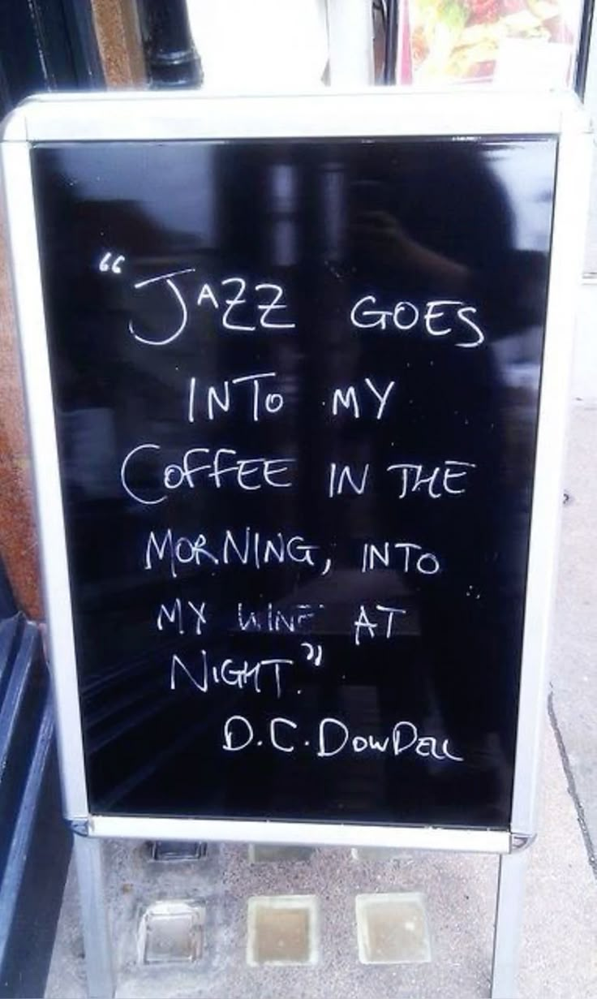

  <!-- Image -->
  

    
  

  <!-- Quote -->
  

    

      <em>“There's something beautifully friendly and elevating about a bunch of guys playing music together.
      This wonderful little world that is unassailable. It's really teamwork, one guy supporting the others,
      and it's all for one purpose, and there's no flies in the ointment, for a while.
      And nobody conducting, it's all up to you. It's really jazz—that's the big secret.
      Rock and roll ain't nothing but jazz with a hard backbeat.”</em>
    

    
― Keith Richards, <em>Life</em>

  

